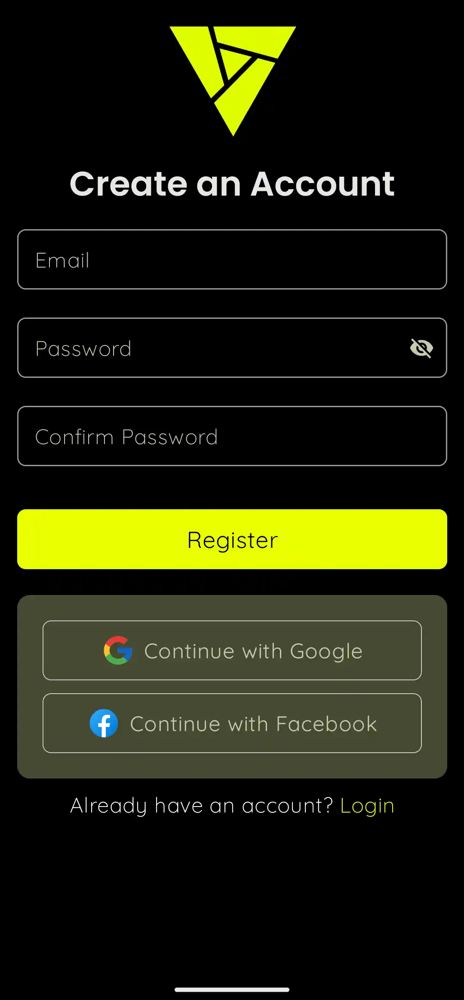
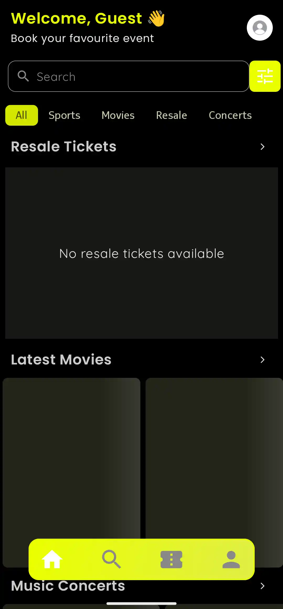
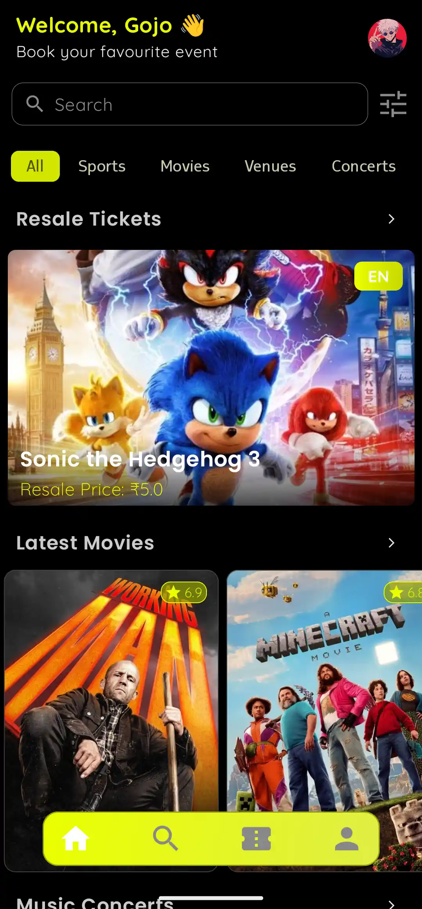
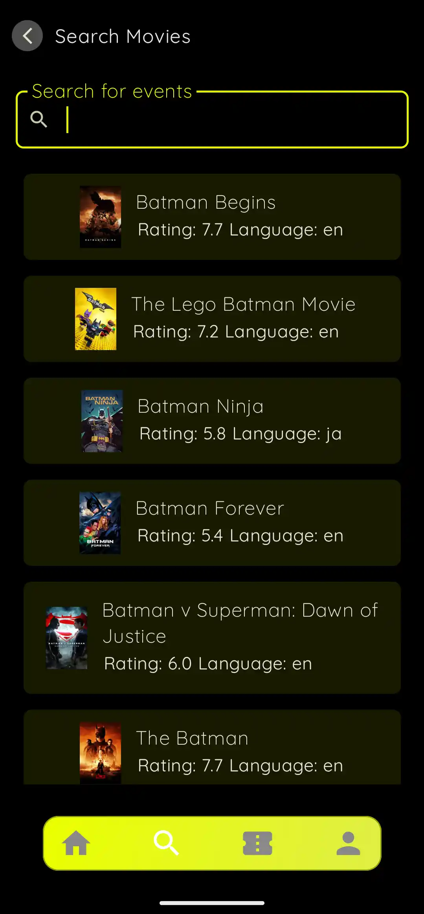
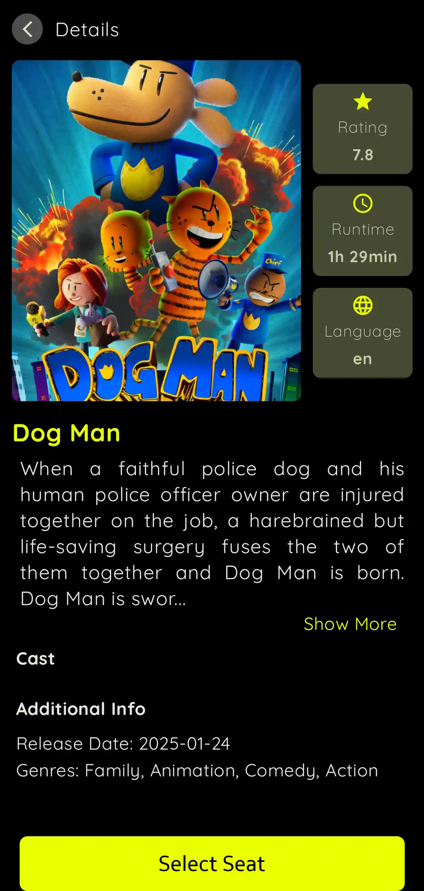
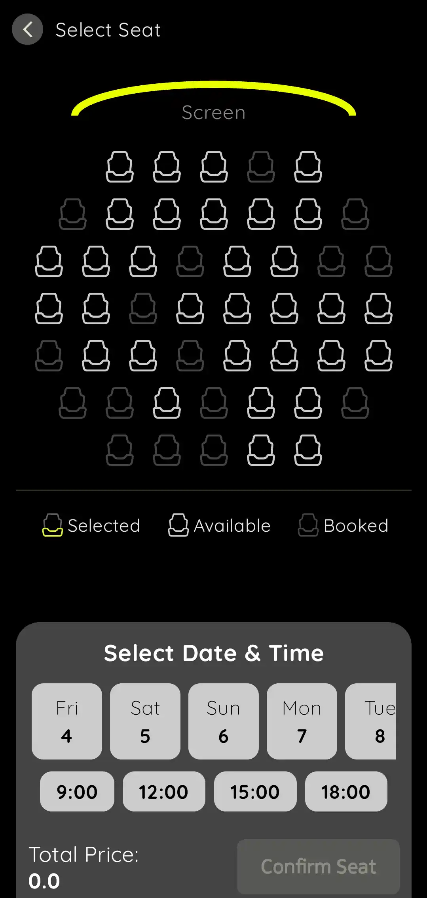
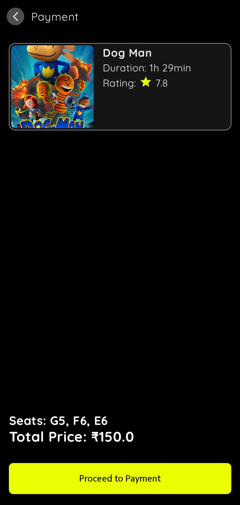
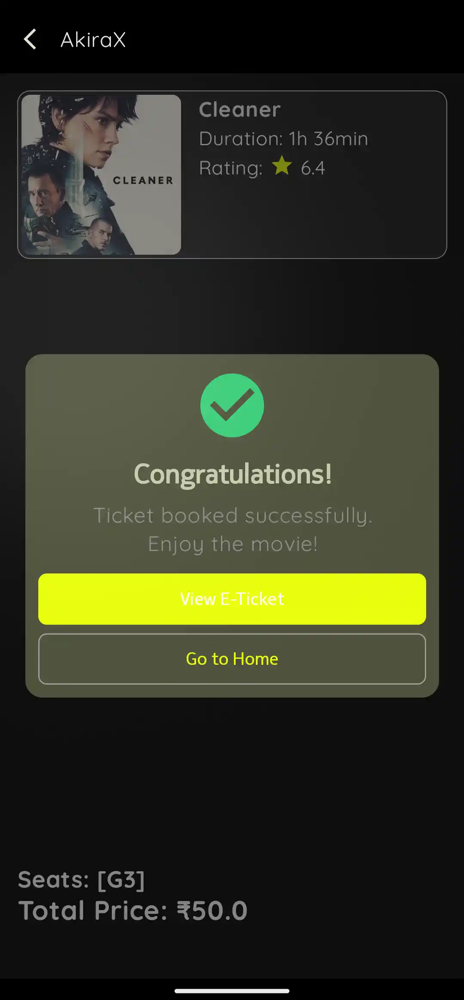

AkiraX 
==========

AkiraX is an Android app for movie ticket booking and resale, built using [Kotlin](https://kotlinlang.org/), [Jetpack Compose](https://developer.android.com/compose) and [Firebase](https://firebase.google.com/) as backend.

✨ Features
----------

-   Secure Authentication: Multi-factor login with [Google Credential Manager](https://developer.android.com/identity/sign-in/credential-manager-siwg)
-   Fraud Prevention: Blockchain-inspired ticket verification system
-   Seamless Payments: Integrated [Cashfree Payment Gateway](https://www.cashfree.com/docs/payments/online/mobile/android) 
-   Ticket Resale: Users can resell unused tickets in a secure way
-   QR Code Ticketing: Generates scannable QR codes for ticket validation
-   Personalized Experience: Fetches movie details from [TMDB API](https://developers.themoviedb.org/3)
-   Smooth UI/UX: [Material Design](https://m3.material.io/), [Shared Element Transitions](https://developer.android.com/develop/ui/compose/animation/shared-elements), [Accompanist Pager](https://google.github.io/accompanist/)

🛠 Technologies Used
--------------------

-   [Firebase](https://firebase.google.com/) - Authentication & Firestore database
-   [Koin](https://insert-koin.io/) - Dependency Injection
-   [Google Credential Manager](https://developer.android.com/identity/sign-in/credential-manager-siwg) - Authentication
-   [Coil](https://coil-kt.github.io/coil/) - Image Loading
-   [Retrofit](https://square.github.io/retrofit/) - API Networking
-   [ZXing](https://github.com/zxing/zxing) - QR Code Generation
-   [Accompanist Pager](https://google.github.io/accompanist) - Smooth Paging
-   [Cashfree Payment Gateway](https://www.cashfree.com/docs/payments/online/mobile/android) - Secure Payments

## 📱 Screenshots

<table align="center">
  <tr>
    <td></td>
    <td></td>
    <td></td>
  </tr>
  <tr>
    <td></td>
    <td></td>
    <td></td>
  </tr>
  <tr>
    <td></td>
    <td></td>
    <td></td>
    
  </tr>
  <tr>
    <td></td>
    <td></td>
    <td></td>
  </tr>
</table>

Markdown

## 🎬 Demo

<div align="center">
  <video src="https://github.com/user-attachments/assets/b2f5a7da-8fb4-42ec-bc9d-c6d133fc922b" controls width="640"></video>
</div>


## 🚀 Setup Guide

### 1️⃣ Clone the Repository

```sh
git clone https://github.com/blizzardOfAce/akirax.git
cd AkiraX
```

### 2️⃣ Firebase Setup
Since the `google-services.json` file is not included in the repository for security reasons, you'll need to set up your own Firebase project:
1. Go to [Firebase Console](https://console.firebase.google.com/)
2. Create a new project (name does not need to match "akirax-21926")
3. Click "Add app" → Select Android icon
4. Enter the package name `com.example.akirax` (this **must** match exactly as in `build.gradle`)
5. Set app nickname (optional, e.g., "AkiraX")
6. Get **SHA-1** key (required for Google Sign-In):
   
   ```sh
   ./gradlew signingReport
   ```
   Copy SHA-1 from the DEBUG variant
8. Click "Register app" → Download `google-services.json`
9. Place it inside the `app/` directory

**Firestore Collections:**
- The app uses two collections: `users` and `resaleTickets`
- These **do NOT need to be manually created**. The app will generate them automatically when first used
- Structure:
  - `users`: Stores user details
  - `resaleTickets`: Stores resale ticket info
  - Each user has a `tickets` subcollection

### 3️⃣ Firebase Services Setup

#### Authentication
1. Go to **Authentication** → **Sign-in method**
2. Enable **Email/Password** and **Google Sign-in**

#### Firestore Database
1. Go to **Firestore Database** → **Create database**
2. Start in production or test mode (adjust security rules later)

**Data Models:**

```kotlin
// User Model
data class User(
    val uid: String,
    val name: String?,
    val email: String?,
    val photoUrl: String?
)
```

```kotlin
// Ticket Model
data class Ticket(
    val eventId: String = "",
    val eventName: String = "",
    val language: String = "",
    val seatNumber: String = "",
    val ownerEmail: String = "",
    val ticketHash: String = "",
    val isForSale: Boolean = false,
    val resalePrice: Double? = null,
    val imageUrl: String? = null,
    val purchaseTimestamp: Long = 0L
)
```

### 4️⃣ Add API Keys & Local Properties

Create a `local.properties` file in the root directory and add:

```properties
TMDB_API_KEY=your_tmdb_api_key
CASHFREE_CLIENT_ID=your_cashfree_client_id
CASHFREE_CLIENT_SECRET=your_cashfree_client_secret
TICKETMASTER_API_KEY=your_ticketmaster_api_key
FIREBASE_WEB_CLIENT_ID=your_firebase_web_client_id
```

Get API keys from:
* [TMDB API](https://developers.themoviedb.org/3/getting-started/introduction)
* [Cashfree API](https://docs.cashfree.com/docs/api-keys)
* [Ticketmaster API](https://developer.ticketmaster.com/products-and-docs/apis/getting-started/)

### 5️⃣ Build & Run 🚀

```sh
./gradlew assembleDebug
```

Open the project in **Android Studio**, connect a device, and run the app! 🎉

## 🛣️ Roadmap

-   [ ] Add support for multiple languages 🌍
-   [ ] Implement real-time notifications 🔔
-   [ ] Enhance UI and features 📲
-   [ ] Implement AR view for venue seating preview 🎭

## 🤝 Contributing

Contributions are welcome! Feel free to fork the repository, create a new branch, and submit a pull request. 🚀
